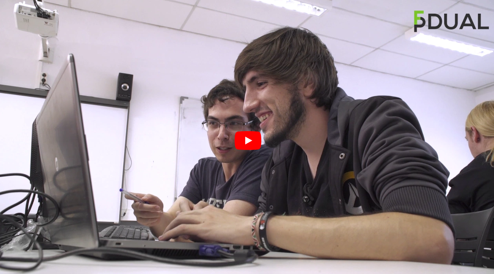

FP Dual Desarrollo Aplicaciones Web - CIFP Francesc de Borja Moll
=================================================================

La metodología del día a día va en la línea de cómo se practican [katas en un dojo de programación](https://en.wikipedia.org/wiki/Kata_(programming) "Entrada wikipedia kata in programming"). 

Aplicamos metodologías ágiles para autoresponsabilizar y comprometer al grupo con su aprendizaje. 

El aprendizaje del grupo se realiza por proyectos. 

El objetivo es entregar un mínimo producto viable en el mes de marzo. El perfil que ofrecemos son personas educadas, altamente motivadas y con gran capacidad de aprendizaje.

Si quieres conocer el perfil que ofrecemos y cómo lo hacemos, échale un ojo a estos dos vídeos de 1 minuto cada uno: 

 - Perfil de nuestro alumnado: 
  

 - Tutores del programa :  [Objetivos de la FP Dual](http://fp-dual.es/tutors-figures-clau-lfp-dual/ "Vídeo tutores indicandi los objetivos del programa Dual")

La [Cámara de Comercio](https://fp-dual.es/ "Site FP Dual Illes Balears") asesora a las empresas durante el proceso de elaboración del contrato de formación que autoriza el SOIB, bajo la coordinación de la [Direcció General de Formació Professional](https://www.caib.es/sites/fp/ca/admissia_dual_curs_2020-2021/ "Site FP Dual Direcció General Formació Professional").

## Syllabus

### Primer curso

#### Proyectos

Los proyectos trimestrales -transversales a todos los móduos que conforman el primer curso del ciclo- _fullstack_ (_front_ +  _back_ + base de datos) a desarrollar mediante parejas de programación de este año son: 

- Primer trimestre, un sistema de _web scrapping_ con `Python`, `Mongo Atlas`, `HTML` y `CSS`, sin utilizar librerías existentes de _scrapping_, programando al más bajo nivel posible.
- Segundo trimestre: API REST con `Flask`, `MySQL` de [una tienda online](https://github.com/dfleta/ollivanders_shop "Tienda mágica Ollivander's") (cliente con `JS`, `HTML` y `CSS`).
- Segundo y tercer trimestre: [receptivo turístico](https://github.com/dfleta/grpc-tourism-receptive "gRPC observer Gof") implementado con microservicios en `Java`.

#### Programación

 - Java, Spring Boot Web, Spring Data, JPA.
 - Maven y Gradle.
 - Python, Flask.
 - Depuración (entrenamiento formal) y testing: refactorización, optimización, programación dirigida por casos test (TDD), JUnit, Mockito, Pytest.
 - API REST
 - Control de versiones 
 - Git, _conventional commits_, _semantic versioning_
 - Patrones SOLID de diseño ágil; patrones de diseño GOF; MVC e inyección de dependencias.
 - Buenas prácticas de codificación (como las expuestas en los libros _"Code complete"_ y _"Clean Code"_, entre otros).
 - Técnicas de _extreme programming_ como la Programación en pareja (_Pair programming_). Agile, Scrum, Kanban + katas.
 - Historias de usuario. 
 - Deuda técnica, refactorización. 
 - Integración continua y entrega continua.
 - Docker.
 - Técnicas de captura de requisitos, análisis y diseño (UML). Modelo estático, modelo dinámico y modelos de comportamiento (UML).
 - Arquitectura de aplicaciones.
 - Domain Driven Development (DDD).
 - Inspecciones formales, pair review.
 - Documentación de proyectos de software.
 
#### Lenguajes de marcas 

 - HTML5, CSS3, Vanilla Javascript ;)
 - Diseño responsivo y adaptativo.
 - XML, XSLT, XPATH, XQUERY, Schemas, DTD, RSS, Markdown; Emmet.
 
#### Bases de datos
 - Modelo E/R y modelo relacional.
 - MariaDB /PostgreSQL: DDL y DML básico. TCL.
 - MongoDB, MongoAtlas.
 
#### Sistemas informáticos
 - Instalación, configuración y administración de sistemas operativos Windows y GNU/Linux.

#### Formación y orientación laboral

### Segundo curso

#### Desarrollo web en entorno cliente
 - Javascript Vanilla ;) 
 - Core y Client Side.
 - CSS3, HTML5, 
 - Alguno de los frameworks AngularJS, ReactJS, Vue, Nuxt, según el proyecto elegido en el curso y las empresas colaboradoras. Este curso ha sido VUE.
 - Node.

#### Desarrollo web en entorno servidor
 - PHP, Laravel.

#### Diseño de interfaces web
 - UX, usabilidad, accesibilidad, 
 - Fundamentos del diseño web.
 - Diversas tecnologías relacionadas con la capa de presentación (SaSS, BootStrap, VUE, entre otras); 
 - Arquitectura de la información.
 - Bootstrap.
 - VUE.

#### Despliegue de aplicaciones web
 - Instalación y configuración de servidores web: apache, DNS, ftp, etc. 
 - Despliegue de aplicaciones. 
 
#### Iniciativa emprendedora.
- El programa dual mantiene una estrecha colaboración con la [Incubadora de empresas de la Fundació Bit](https://www.fundaciobit.org/es/tag/incubadora-de-empresas-es/ "Site Incubadora Fundació Bit") y, en particular, con el programa [Emprenbit](http://www.emprenbit.org/?Idi=1 "Site Emprenbit").

#### Proyecto final de ciclo

--------

## Contrato formativo

### Beneficios para las empresas

No se trata de unas prácticas al uso de formación profesional, por los siguientes motivos:

 - El alumno/a se incorpora a la empresa entre marzo y junio del año 2021.
 - De octubre de 2020 a marzo de 2021 acuden a clase todos los días 6 horas. 
 - A partir de este 6º mes de formación (marzo) acuden a la empresa **5 horas cada día, por la mañana, bajo un contrato de formación de 25 horas a la semana** y 3 horas por la tarde al centro formativo.
 - En los meses de verano el contrato puede ampliarse hasta 8 horas al día de trabajo en la empresa. Durante los últimos 4 meses de la formación (marzo - junio del segundo curso) el contrato puede ampliarse a 34 horas a la semana.
 - El contrato es un contrato de formación. **La seguridad social de este trabajador/a está 100% bonificada durante todo el período del contrato**, siempre que la empresa esté al corriente de pago de Hacienda y Seguridad social y cumpla con los requisitos para formalizar este contrato. Al finalizar el contrato, la **transformación a indefinido da derecho a una reducción de cuotas empresariales de 1.500 €, o 1.800 €** si se trata de una mujer, durante tres años.
 - El trabajador/a cobra según convenio. La experiencia muestra que se mueven en una horquilla de entre 500€ - 750€ al mes. Según convenio colectivo y categoría de "programador web" corresponderían 643 €/mes.
 - **Se bonifica la tutorización del tutor de empresa en los seguros sociales**, con carácter mensual. El importe depende del tamaño de la empresa, máximo 80 € en empresas de hasta 5 trabajadores y de 60€ en empresas de más de 5 trabajadores. Se tiene en cuenta el número de horas dedicadas mensualmente con un límite de 40 horas así, como el número de alumnos tutorizados.
 - Existe el período de prueba que estipule el convenio. Si transcurrido un mes se presentan circunstancias que hacen inviable mantener el contrato del alumno/a, también puede extinguirse. 
 - El período de vacaciones del alumno/a se ciñe a lo estipulado en el convenio.
 - **El contrato posee una duración mínima de 12 meses**, a comenzar entre marzo y junio del año 2021, y se extiende hasta que finaliza la actividad formativa (los estudios del ciclo, junio 2022). Esto facilita la incorporación del alumno/a en función del número de proyectos previstos.
 - El seguimiento por parte de los tutores/as del centro educativo es continuo. Es necesario asignar a una persona como tutor/a del centro de trabajo que trabaja en coordinación con nosotros. 
 - **La Cámara de Comercio de Mallorca asesora durante la gestión del contrato**, lo que facilita mucho el ya de por sí escaso papeleo que conlleva. El **SEPE autoriza los contratos** y la Direcció General de Formació Professional coordina y supervisa el proceso. 
- Como empresas colaboradoras contamos con un abanico amplio de perfiles, desde PYMES hasta consultoras del sector TIC de la Isla.

---------

## Qué dicen las empresas del programa

[Brújula es una de les empreses que apuesta por nosotros/as](https://fp-dual.es/limportant-paper-empreses-lfp-dual/ "Vídeo Brújula")

## Participa como empresa

Envía el **documento de adhesión** [CAT](./documento%20adhesión%20de%20empresa/Compromis_participacio_2020-2021_cat.pdf "PDF adhesió Català") - [ES](./documento%20adhesión%20de%20empresa/Compromiso%20participación%202020-2021_es.pdf "PDF adhesión Castellano")  al [coordinador del programa]() o a la Cámara de Comercio.

-------------

## Un resumen y recursos

[@gelpi](https://linktr.ee/gelpi)

-------------

## Prensa

 - [Alumnado de Dual en desarrollo de apps web y administración de sistemas y redes en Cocodin.](https://www.instagram.com/p/CKn7PbNjzqK/ "Publicaión Instagram alumnado Cocodin")
 - [Objetivos de la FP Dual en desarrollo de aplicaciones web y administración de sistemas y redes.](https://www.instagram.com/p/CKlySiKKjkc/ "Publicaciónn instagram Objetivos FP Dual") 
 - [Instagram FP Dual Mallorca](https://www.instagram.com/fpdual_mallorca/ "Instagram FP Dual Mallorca")